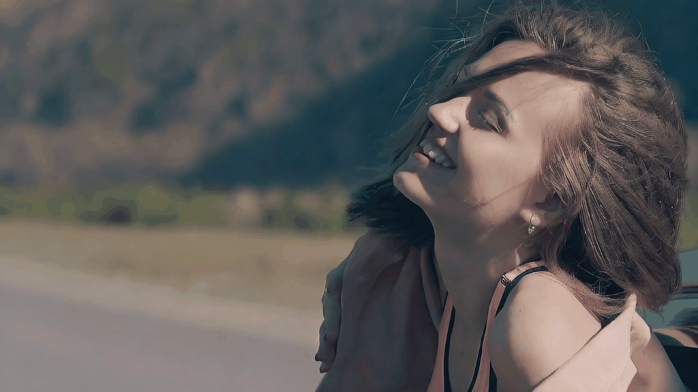
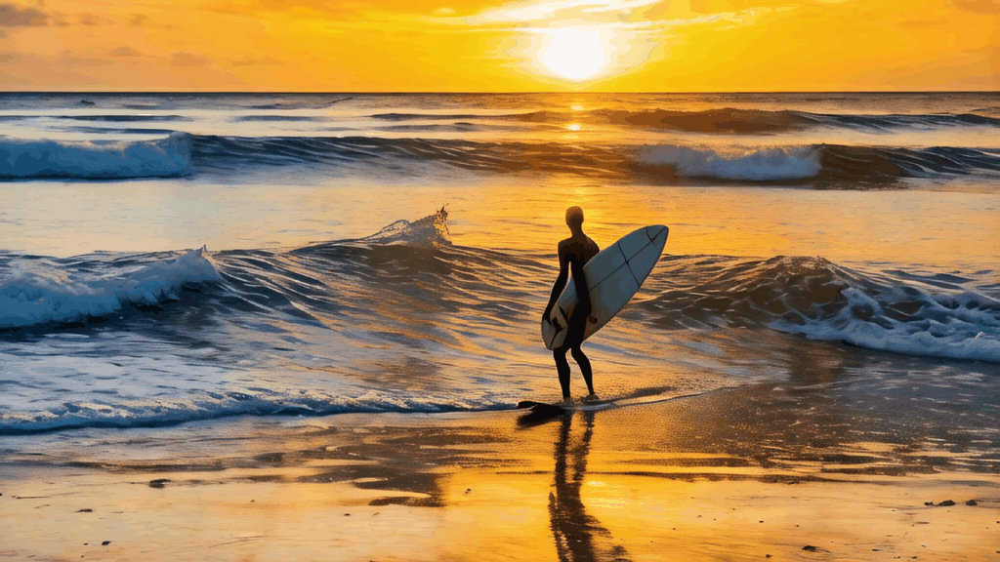

## SF-V <br><sub> Single Forward Video Generation Model</sub>

[](https://arxiv.org/abs/2406.04324)
[](https://snap-research.github.io/SF-V/)

This respository contains the code for the NeurIPS 2024 paper [SF-V: Single Forward Video Generation Model](https://arxiv.org/abs/2406.04324).
For more visualization results, please check our [project page](https://snap-research.github.io/SF-V/).

> **[SF-V: Single Forward Video Generation Model](https://arxiv.org/abs/2406.04324)** \
> [Zhixing Zhang](https://zhang-zx.github.io/) <sup>1,2</sup>,
> [Yanyu Li](https://scholar.google.com/citations?user=XUj8koUAAAAJ) <sup>1</sup>,
> [Yushu Wu](https://scholar.google.com/citations?user=3hEDsFYAAAAJ) <sup>1</sup>,
> [Yanwu Xu](https://xuyanwu.github.io/) <sup>1</sup>,
> [Anil Kag](https://anilkagak2.github.io/) <sup>1</sup>,
> [Ivan Skorokhodov](https://universome.github.io/) <sup>1</sup>,
> [Willi Menapace](https://scholar.google.com/citations?user=31ha1LgAAAAJ) <sup>1</sup>,
> [Aliaksandr Siarohin](https://aliaksandrsiarohin.github.io/aliaksandr-siarohin-website/) <sup>1</sup>,
> [Junli Cao](https://scholar.google.com/citations?user=BV98MGAAAAAJ) <sup>1</sup>,
> [Dimitris Metaxas](https://people.cs.rutgers.edu/~dnm/) <sup>2</sup>,
> [Sergey Tulyakov](http://www.stulyakov.com/) <sup>1</sup>,
> and [Jian Ren](https://alanspike.github.io/) <sup>1</sup> \
> <sup>1</sup> Snap Inc.
> <sup>2</sup> Rutgers University


<div align="center">
<table width=100%>
    <tr>
        <td></td>
        <td></td>
        <td></td>
        <td></td>
    </tr>
</table>
</div>

**TL;DR:** **SF-V** is a video generation method that can generate high-quality and motion consistent videos by only performing the sampling once during inference.
> Diffusion-based video generation models have demonstrated remarkable success in obtaining high-fidelity videos through the iterative denoising process. However, these models require multiple denoising steps during sampling, resulting in high computational costs. In this work, we propose a novel approach to obtain _single_-step video generation models by leveraging adversarial training to fine-tune pre-trained video diffusion models. We show that, through the adversarial training, the multi-steps video diffusion model, _i.e._, Stable Video Diffusion (SVD), can be trained to perform _single_ forward pass to synthesize high-quality videos, capturing both temporal and spatial dependencies in the video data. Extensive experiments demonstrate that our method achieves competitive generation quality of synthesized videos with significantly reduced computational overhead for the denoising process (_i.e._, around 23x speedup compared with SVD and 6x speedup compared with existing works, with even better generation quality), paving the way for real-time video synthesis and editing.


## Reference

If our work helps you, please consider to cite our paper. Thanks!

```BibTeX
@article{zhang2022sfv,
  title={SF-V: Single Forward Video Generation Model},
  author={Zhang, Zhixing and Li, Yanyu and Wu, Yushu and Xu, Yanwu and Kag, Anil and Skorokhodov, Ivan and Menapace, Willi and Siarohin, Aliaksandr and Cao, Junli and Metaxas, Dimitris and Tulyakov, Sergey and Ren, Jian},
  journal={arXiv preprint arXiv:2406.04324},
  year={2024}
}
```